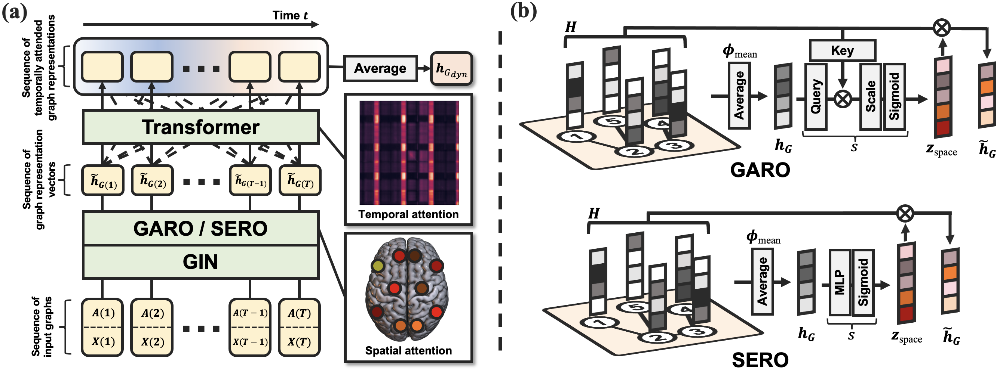

# STAGIN
## Spatio-Temporal Attention Graph Isomorphism Network

### Paper
PyTorch implementation of STAGIN from the preprint:
[Learning Dynamic Graph Representation of Brain Connectome with Spatio-Temporal Attention](https://arxiv.org/abs/2105.13495)


### Concept



### Dataset
The fMRI data used for the experiments of the paper should be downloaded from the [Human Connectome Project](https://db.humanconnectome.org/).


### Commands
Run the main script to perform experiments

  ```shell
  python main.py
  ```

Command-line options can be listed with -h flag.

  ```shell
  python main.py -h
  ```


### Requirements
- python 3.8.5
- numpy == 1.20.2
- torch == 1.7.0
- torchvision == 0.8.1
- einops == 0.3.0
- sklearn == 0.24.2
- nilearn == 0.7.1
- nipy == 0.5.0
- pingouin == 0.3.11
- tensorboard == 2.5.0
- tqdm == 4.60.0

For brainplot:
- MRIcroGL >= 1.2
- opencv-python == 4.5.2


### Contact
egyptdj@yonsei.ac.kr
