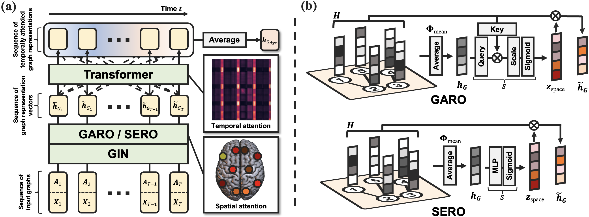

# STAGIN
## Spatio-Temporal Attention Graph Isomorphism Network

### Paper
**Learning Dynamic Graph Representation of Brain Connectome with Spatio-Temporal Attention** \
Byung-Hoon Kim, Jong Chul Ye, Jae-Jin Kim \
presented at *NeurIPS 2021* \
<sub><sup>[arXiv](https://arxiv.org/abs/2105.13495), [OpenReview](https://openreview.net/forum?id=X7GEA3KiJiH), [proceeding](https://papers.nips.cc/paper/2021/hash/22785dd2577be2ce28ef79febe80db10-Abstract.html)</sup></sub>


### Concept



### Dataset
The fMRI data used for the experiments of the paper should be downloaded from the [Human Connectome Project](https://db.humanconnectome.org/).

##### Example structure of the directory tree
```
data (specified by option --sourcedir)
├─── behavioral
│    ├─── hcp.csv
│    ├─── hcp_taskrest_EMOTION.csv
│    ├─── hcp_taskrest_GAMBLING.csv
│    ├─── ...
│    └─── hcp_taskrest_WM.csv
├─── img
│    ├─── REST
│    │    ├─── 123456.nii.gz
│    │    ├─── 234567.nii.gz
│    │    ├─── ...
│    │    └─── 999999.nii.gz
│    └─── TASK
│         ├─── EMOTION
│         │    ├─── 123456.nii.gz
│         │    ├─── 234567.nii.gz
│         │    ├─── ...
│         │    └─── 999999.nii.gz
│         ├─── GAMBLING
│         │    ├─── ...
│         │    └─── 999999.nii.gz
│         ├─── ...
│         └─── WM
│              ├─── ...
│              └─── 999999.nii.gz
└───roi
     └─── 7_400_coord.csv
```
##### Example content of the csv files
###### [data/behavioral/hcp.csv](https://db.humanconnectome.org/REST/search/dict/Subject%20Information/results?format=csv&removeDelimitersFromFieldValues=true&restricted=0&project=HCP_1200)
```
| Subject | Gender |
|---------|--------|
| 123456  |   F    |
| 234567  |   M    |
| ......  | ...... |
| 999999  |   F    |
```

###### [data/behavioral/hcp_taskrest_WM.csv](./asset/)
```
| Task | Rest |
|------|------|
|  0   |  1   |
|  0   |  1   |
| ...  | ...  |
|  1   |  0   |
```

###### [data/roi/7_400_coord.csv](https://github.com/ThomasYeoLab/CBIG/blob/master/stable_projects/brain_parcellation/Schaefer2018_LocalGlobal/Parcellations/MNI/Centroid_coordinates/Schaefer2018_400Parcels_7Networks_order_FSLMNI152_2mm.Centroid_RAS.csv)
```
| ROI Index | Label Name                 | R | A | S |
|-----------|----------------------------|---|---|---|
|         0 | NONE                       | NA| NA| NA|
|         1 | 7Networks_LH_Vis_1         |-32|-42|-20|
|         2 | 7Networks_LH_Vis_2         |-30|-32|-18|
|       ... | .........                  | . | . | . |
|       400 | 7Networks_RH_Default_PCC_9 | 8 |-50| 44|
```


### Commands
Run the main script to perform experiments

  ```shell
  python main.py
  ```

Command-line options can be listed with -h flag.

  ```shell
  python main.py -h
  ```


### Requirements
- python 3.8.5
- numpy == 1.20.2
- torch == 1.7.0
- torchvision == 0.8.1
- einops == 0.3.0
- sklearn == 0.24.2
- nilearn == 0.7.1
- nipy == 0.5.0
- pingouin == 0.3.11
- tensorboard == 2.5.0
- tqdm == 4.60.0

For brainplot:
- MRIcroGL >= 1.2
- opencv-python == 4.5.2


### Updates
- 2022-04-29 `5c262d8d`: Top k-percentile values from the adjacency matrix is now calculated without the need for calling `.detach().cpu().numpy()` which improves computation speed.
- 2023-04-11 [`2aa53b9`](https://github.com/egyptdj/stagin/commit/2aa53b950874c7a6bacc97556b5b66e1785d4cc3)-[`40e2bc6`](https://github.com/egyptdj/stagin/commit/40e2bc6e818fe3af7ed61bc24d16fb601dde5e35): Added dataset classes for ukb-rest, abide, and fmriprep; Implemented regression experiments.

### Contact
egyptdj@yonsei.ac.kr
